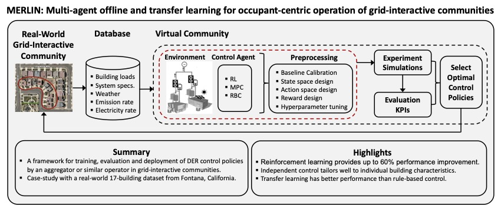

# MERLIN APEN 2023



This repository provides the source-code to reproduce the [MERLIN: Multi-agent offline and transfer learning for occupant-centric operation of grid-interactive communities](https://arxiv.org/abs/2301.01148) paper. Refer to the paper for detailed explanations of the experiments desribed here as well as the general scope of this work.

## Reproduction

Begin by cloning this repository:

```console
git clone https://github.com/intelligent-environments-lab/merlin-apen-2023.git
```

Then, install the Python [dependencies](requirements.txt):

```console
pip install requirements.txt
```

The following sections describe how to run each experiment:

### Reference rule-based control design

> ⚠️ **NOTE**:
> This experiment is optional and can be skipped.

The first experiment is to define the reference RBC. The RBCs are defined in Run the following command to set up the work order and create input files needed for the simulation:

```console
python src/experiment.py rbc_validation set_work_order
```

The next command runs the CityLearn simulations for the RBC validation experiment:

```console
python src/experiment.py rbc_validation run_work_order
```

The simulation results are generated by running the following command:

```console
python src/experiment.py rbc_validation set_result_summary -d
```

Finally, analyze the results by running the [rbc_validation.ipynb](analysis/rbc_validation.ipynb) notebook from start to finish. 

The reference RBC selected in the paper is the [TOUPeakReductionFontanaRBC](src/agent.py#L38) RBC. However, one can use any of the other two RBCs: [SelfConsumptionFontanaRBC](src/agent.py#L9) or [TOURateOptimizationFontanaRBC](src/agent.py#L65). To set the reference RBC, replace the value of the `experiments:rbc_validation:optimal` in [setting.json](src/settings.json#73).

### Reinforcement learning control design

> ⚠️ **NOTE**:
> This experiment is optional and can be skipped.

> ⚠️ **NOTE**:
> This experiment takes a while to complete.

The second experiment is to carry out a grid search to find best performing hyperparameters for the [SAC RL agent](src/agent.py#89). One can use the default search grid or define a custom grid value in `experiments:hyperparameter_design:grid` in [setting.json](src/settings.json#94). Begin by setting the work order followed by running the simulation and finally setting the result summary:

```console
python src/experiment.py hyperparameter_design_1 set_work_order
python src/experiment.py hyperparameter_design_1 run_work_order
python src/experiment.py hyperparameter_design_1 set_result_summary
```

Post-simulation analysis is done in the [hyperparameter_design_1.ipynb](analysis/hyperparameter_design_1.ipynb) notebook.

Either keep the already set hyperparameters or update the `experiments:rbc_validation:optimal` value in [setting.json](src/settings.json#100).

### Reward Design

> ⚠️ **NOTE**:
> This experiment is optional and can be skipped.

> ⚠️ **NOTE**:
> This experiment takes a while to complete.

Run this experiment to determine the best weights nad exponents for the [reward function](src/reward.py#25). Like the previous experiments, first set then run the work order before setting the result summary:

```console
python src/experiment.py reward_design_1 set_work_order
python src/experiment.py reward_design_1 run_work_order
python src/experiment.py reward_design_1 set_result_summary -d
```

Post-simulation analysis is done in the [reward_design_1.ipynb](analysis/reward_design_1.ipynb) notebook.

Either keep the already set weights or update the `experiments:reward_design:weight` and `experiments:reward_design:exponent` values in [setting.json](src/settings.json#88).

### RBC Reference 1

> ⚠️ **NOTE**:
> This experiment is NOT optional.

The RBC Reference 1 experiment simulates all buildings in CityLearn on full year data using the [selected reference RBC](#reference-rule-based-control-design). The results are used to compare the results from the [Deployment Strategy 1.0](#deployment-strategy-10) and [Deployment Strategy 2.0](#deployment-strategy-20) experiments. Execute the following commands to run and set the results of this experiment:

```console
python src/experiment.py rbc_reference_1 set_work_order
python src/experiment.py rbc_reference_1 run_work_order
python src/experiment.py rbc_reference_1 set_result_summary -d
```

Finally, run the [rbc_reference_1.ipynb](analysis/rbc_reference_1.ipynb) to get the post-simulation analysis.

### RBC Reference 3

> ⚠️ **NOTE**:
> This experiment is NOT optional.

The RBC Reference 3 experiment simulates all buildings in CityLearn on part year data using the [selected reference RBC](#reference-rule-based-control-design). The results are used to compare the results from the [Deployment Strategy 3.1](#deployment-strategy-31) and [Deployment Strategy 3.2](#deployment-strategy-32) experiment. Execute the following commands to run and set the results of this experiment:

```console
python src/experiment.py rbc_reference_3 set_work_order
python src/experiment.py rbc_reference_3 run_work_order
python src/experiment.py rbc_reference_3 set_result_summary -d
```

Finally, run the [rbc_reference_3.ipynb](analysis/rbc_reference_3.ipynb) to get the post-simulation analysis.

### Deployment Strategy 1.0

> ⚠️ **NOTE**:
> This experiment is NOT optional.

> ⚠️ **NOTE**:
> This experiment takes a while to complete.

This experiment simulates all buildings in CityLearn, find optimal policy on full year data. Execute the following commands to run and set the results of this experiment:

```console
python src/experiment.py deployment_strategy_1_0 set_work_order
python src/experiment.py deployment_strategy_1_0 run_work_order
python src/experiment.py deployment_strategy_1_0 set_result_summary -d
```

Finally, run the [deployment_strategy_1_0.ipynb](analysis/deployment_strategy_1_0.ipynb) to get the post-simulation analysis.

### Deployment Strategy 1.1

### Deployment Strategy 2.0

### Deployment Strategy 3.0

### Deployment Strategy 3.1

### Deployment Strategy 3.2


## Citation

```bib
@misc{nweyeMERLINMultiagentOffline2023,
	title = {{MERLIN}: {Multi}-agent offline and transfer learning for occupant-centric energy flexible operation of grid-interactive communities using smart meter data and {CityLearn}},
	copyright = {Creative Commons Attribution 4.0 International},
	url = {https://arxiv.org/abs/2301.01148},
	publisher = {arXiv},
	author = {Nweye, Kingsley and Sankaranarayanan, Siva and Nagy, Zoltan},
	year = {2023},
	doi = {10.48550/ARXIV.2301.01148},
	keywords = {Artificial Intelligence (cs.AI), electronic engineering, FOS: Computer and information sciences, FOS: Electrical engineering, information engineering, Machine Learning (cs.LG), Systems and Control (eess.SY)},
}
```